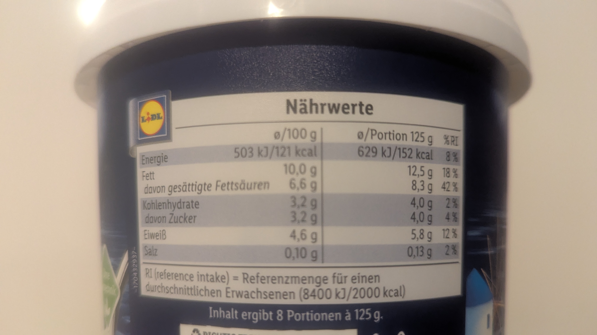
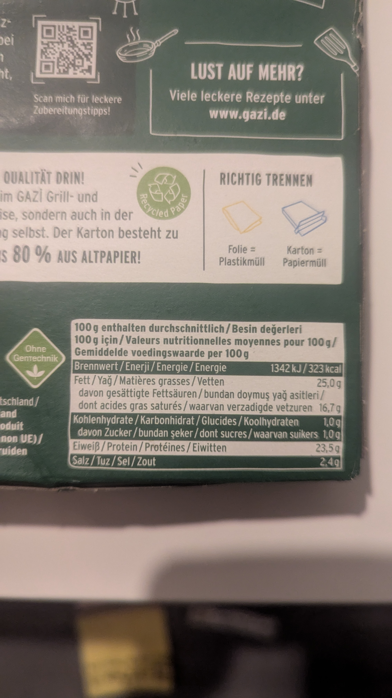
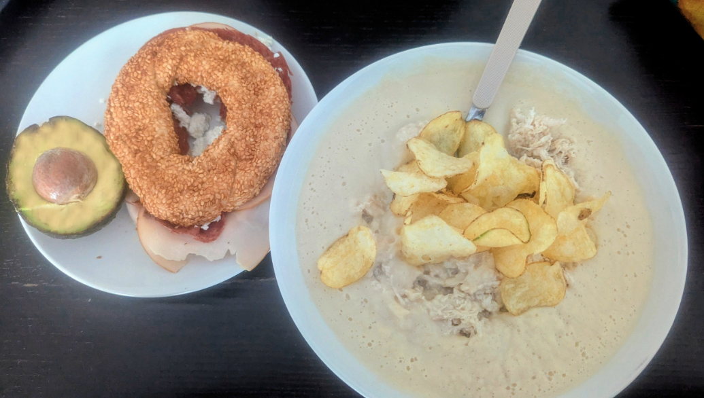

# 🏋️ Fitness GTips

Let's get some info...

### 1. Age

| Age Range     | Score | 
|---------------|:-----:|
| 18–25 years   |  +2   | 
| 26–35 years   |  +1   | 
| 36+ years     |   0   | 

---

### 2. WEIGHT – the truth

| Weight Range      | Score |  |
|-------------------|:-----:|------------|
| 45 Kg or less     |   0   | You're probably banned from NC-17 movies. |
| 60–90 Kg          |  +1   | Functional adult mass. |
| 90.5–105 Kg       |  +2   | Your hugs are elite, and so are your cholesterol levels. |
| 105.5–115 Kg      |  +3   | Move |
| 115.5 Kg and up   |  +4   | Technically a tank. |

---

### 3. hobbit or human?

| Height Range | Score | 
|--------------|:-----:|
| 1.61 or less |   0   |
| 1.65–1.72     |  +1   |
| 1.72–1.84     |  +2   |
| 1.84 and up  |  +3   | 

---

### 4. HOW ACTIVE ARE YOU ?

| Activity Level         | Score | Commentary |
|------------------------|:-----:|------------|
| Once a week            |   0   |Move bro. |
| 3x per week            |  +1   | ok |
| 5–7x per week          |  +2   | 💪 |

---

### 5. Why are you doing this to yourself?

| Goal                          | Score | 
|-------------------------------|:-----:| 
| I need to lose weight         |   0   | ₍ᐢ･⚇･ᐢ₎ |
| Burn the last stubborn fat    |  +1   | 
| I wanna get bigger            |  +2   | 

---

### 6. DAILY CALORIE TARGET

| Final Score | Daily Calories       | 
|-------------|----------------------|
| 2 or less   | 1,900–2,199 cal       | 
| 3–5         | 2,200–2,499 cal       | 
| 6–7         | 2,500–2,799 cal       | 
| 8+          | 2,800–3,000 cal       | 

---

#  At the GYM

## ROUTINES

---

### 📅 Day 1: Chest & Triceps

#### 💀 Killer routine 1

| Target  | Exercise                   | Sets x Reps | Description |YouTube Link |
|---------|----------------------------|-------------|--------------|--------------|
| Middle Chest   | Bench Press from hell        | 10×15      |Use the 60% of the max weight you can lift, you **MUST** complete the 15 reps, if need it, rest for 20-30 secs, and continue. Easier if you have a spotter.   | Just the classic bench press([Video](https://youtu.be/gRVjAtPip0Y))|
| Upper Chest   | Incline Dumbbell Press     | 3×10     |At this point you'll be wasted, again 60% of the max weight, and complete the reps.😡 | [Video](https://youtu.be/8iPEnn-ltC8) |
| Lower Chest   | Cable Crossover            | 3×10| Focus on the lower chest only.    | [Video](https://youtu.be/KwvJEXts2lg?si=_9NyeJLS0ZC3Qmc5) |
| Triceps | Close-Grip Bench Press     | 3×10      |Light weight, enough to feel the muscle burning.| [Video](https://youtu.be/FiQUzPtS90E?si=1A0ux1grrVBYHN1N) |
| Triceps | Cable Triceps Pushdown     | 3×15     |Moderate weight, but go to failure |[Video](https://youtu.be/2-LAMcpzODU) |

#### 💀 Killer routine 2 ...(soon)
#### 💀 Killer routine 3 ...(soon)
---

### 📅 Day 2: Back & Biceps

#### 💀 Killer routine 1

| Muscle  | Exercise                | Sets x Reps | Description | YouTube Link|
|---------|--------------------------|-------------|--------------|--------------|
| Lats    | Pull-Ups                | 3×8      |This is tough, but the best to start, **complete the reps**.| [Video](https://youtu.be/eGo4IYlbE5g) |
| Lats    | Lat Pulldown            | 4×15     |65% of the max. weight and ...**COMPLETE THE REPS**.| [Video](https://youtu.be/CAwf7n6Luuc) |
| Back    | Seated Cable Row        | 4×15        |65% of the weight...😡 just do it!| [Video](https://youtu.be/NYok5zjbDcw?si=3MjRDyCWrGvudxx2) |
| Lower Back    | Deadlift                | 4×15       |60% of the weight, to failure bro.| [Video](https://youtu.be/op9kVnSso6Q) |
| Biceps  | Barbell Curl            | 3×10     |Go as heavy as you wish/can, your back shall not move, and do the complete movement.| [Video](https://youtu.be/kwG2ipFRgfo) |
| Biceps  | Incline DB Curl         | 3×10     |Go as heavy as you wish/can, **your palms should always face the ceiling**| [Video](https://youtu.be/soxrZlIl35U) |
#### 💀 Killer routine 2 ...(soon)
#### 💀 Killer routine 3 ...(soon)

---

### 📅 Day 3: Legs (Quads, Hamstrings, Glutes, Calves)

#### 🏋️ Volume (Hypertrophy)

| Muscle  | Exercise                | Sets x Reps | Description | YouTube Link|
|---------|--------------------------|-------------|--------------|--------------|
| Most of them      | Squat         | 4×15      |The king of all exercises, use the 65% of the max weight, **do the correct movement, serious injuries may happen by lifting too heavy or in a shitty way**🙋‍♂️, protect your back with a belt and **complete the reps**😡| [Video](https://youtu.be/ultWZbUMPL8) |
| Bicep femoris      | Leg Curl          | 4×20     |Reps over weight 65% of max weight, complete the reps.| [Sit](https://youtube.com/shorts/_lgE0gPvbik?si=fHDHoX0m_HK-7Eqw) / [Lay](https://youtube.com/shorts/ANKSmhT0dTk?si=NHimuldahEtV2505) |
| Quads      | Leg Extension          | 4×30     |50% of the max weight, you gonna suffer but it worth it, **NO MATTER WHAT COMPLETE THE REPS.**| [Video](https://youtu.be/o90ocSBDJis?si=z1pMQbqgSxnr1HO6) |
| Glutes     | Hip Thrusts        | 3×15     |At this point your legs will be shaking like a newborn deer🦌 60% of the weight| [Video](https://youtu.be/LM8XHLYJoYs) |
| Calves     | Standing Calf Raise| 4×20     |After each serie you will go to failure only with your body weight| [Video](https://youtube.com/shorts/haHcBAd637E?si=NUpH6jhhK45hb3Uz) |
| Calves     | Standing Calf Raise| 4×15-20     |Complete this routine, 15 to 20 reps for each| [Video](https://youtube.com/shorts/t7XLTv64OW8?si=_3ivEzZP4dC2H1AT) |

---
### ... more to come
### 📅 Day 4: Shoulders & Traps
### 📅 Suplements: what, when, how, why.
### 📅 Mobility
### 📅 Stretching
### 📅 Receipts, healthy cooking

---

---
#  🏠 At home

## 🧾 How to Read a Nutrition Labels like a real G
This guide helps you understand the most important elements of a nutrition table, based on values **per 100g** unless stated otherwise.

### 🥣 Example 1: Greek Yogurt Nutrition Breakdown (Lidl Brand)

---
#### 2. 🔥 Calories

| Energy (Energie) | per 100g         | 
|------------------|------------------|
| Energy           | 121 kcal |

> ✅ Low-calorie option, good for cutting or maintaining weight.

---

#### 3. 🧈 Fat (Fett)

| Type                          | per 100g | 
|-------------------------------|----------|
| Total Fat (Fett)              | 10.0 g   |
| Saturated Fat (gesättigte Fette) | 6.6 g    | 

> ⚠️ Saturated fat is quite high — 42% of daily allowance per serving.

---

#### 4. 🍞 Carbohydrates (Kohlenhydrate)

| Type             | per 100g | 
|------------------|----------|
| Total Carbs      | 3.2 g    |
| of which Sugars  | 3.2 g    |

> ✅ Very low in sugar and carbs – suitable for low-carb diets.

---

#### 5. 🥚 Protein (Eiweiß)

| Protein | per 100g | 
|---------|----------|
|         | 4.6 g    |

> 🟨 Moderate protein level – useful as a light snack, but not a high-protein source.

---

#### 6. 🧂 Salt (Salz)

| Salt | per 100g |
|------|----------|
|      | 0.10 g   |

> ✅ Very low in salt.

---

#### 📋 Resume

- [x] Low in calories  
- [x] Low in sugar  
- [x] Low in salt  
- [ ] High in protein (moderate only)  
- [ ] Low in saturated fat 

---

### 🥣 Example 2: 🧀 GAZİ Grilled Cheese Nutrition Breakdown

This grilled cheese product is **energy-dense**, high in **fat** and **protein**, and moderately salty. Here’s how to read the label:

---

#### 2. 🔥 Calories

| Energy (Energie) | per 100g          |
|------------------|---------------|
| Brennwert        | 323 kcal |

> 🧠 This is a **high-calorie product**.

---

#### 3. 🧈 Fat (Fett)

| Type                            | Value   |
|---------------------------------|---------|
| Total Fat (Fett)                | 25.0 g  |
| Saturated Fat (gesättigte FS)  | 16.7 g  |

> ⚠️ Very high in saturated fat.

---

#### 4. 🍞 Carbohydrates (Kohlenhydrate)

| Type           | Value |
|----------------|-------|
| Total Carbs    | 1.0 g |
| of which Sugar | 1.0 g |

> ✅ Very low in carbs and sugar.

---

#### 5. 🥚 Protein (Eiweiß)

| Protein | Value  |
|---------|--------|
|         | 23.5 g |

> 💪 High-protein cheese – great for muscle support and satiety.

---

#### 6. 🧂 Salt (Salz)

| Salt | Value |
|------|-------|
|      | 2.4 g |

> ⚠️ High in salt – over 40% of daily recommended intake per 100g.

---

#### 📋 Resume

- [x] High protein  
- [ ] Low fat  
- [ ] Low saturated fat (⚠️ very high!)  
- [x] Low sugar  
- [ ] Low salt (⚠️ quite salty)  
- [ ] Low calorie (⚠️ energy-dense)
---
# 🧾 Macro Tracking for Mortals  

This is how you **track your macros**, **weigh your food**, and **conquer your goals**.

Whether you're here to:
- 🏋️ Build muscle  
- 🧨 Burn fat  
- 🧘‍♀️ Not feel guilty eating  

---

## 🧠 The Macro Basics

**Macros = Macronutrients** =  
- **Protein** (4 kcal/g)  = 1 protein gram = 4 calories
- **Carbs** (4 kcal/g)  = 1 carb gram = 4 calories
- **Fat** (9 kcal/g)  = 1 fat gram = 9 calories

> ⚠️ TL;DR: **Fat is more than twice the calories of carbs or protein.** i.e. That peanut butter hits harder than you think.

---

## 🔍 🍲 Recipe 1: Veggies soup with chicken breast & fries

### 🛒 Ingredients:
- 🥦 **150g Cauliflower**  
- 🌱 **20g Edamame**  
- 🌿 **15g Peas**  
- 🍅 **15g Tomato**  
- 🧅 **15g Onion**  
- 🍗 **300g Chicken Breast**  
- 🍟 **30g Fries (cooked)**  
- 🧂 Salt, pepper, garlic, spicy stuff
---
- Carbs (Vegetables): 
	- Cauliflower: source of good carbs 👼
	- ⚠️ Edamame: high on protein (you get 12 protein grams per 100 Edamame grams)
	-  peas, tomato, onion: tasty
- Protein: 
	- Chicken breast: you get ~31 protein grams /100 grams and only 124 calories 💪
- Fat (Fries):
	-  ~160 calories/100 g in average; mostly Saturated Fat and evil carbs 😈
	-  just to make it tasty

---

### 🔥 Instructions:

1. Toss all the veggies and chicken into a pressure cooker.
2. Add salt, pepper, garlic, and a touch of spice (or don’t 👸).
3. Cook for **30–40 mins** on pressure setting.
4. ⚠️CAREFULLY blend the veggies **using the cooking water**.
5. Shred the chicken and stir it into the blended soup.
6. Top with as many fries as your macro budget allows.
7. Enjoy. 

---

### ⚖️ Nutrition Facts (1 Serving – All Ingredients Combined)

| **Ingredient**         | **Amount (g)** | **Protein (g)** | **Carbs (g)** | **Fat (g)** | **Calories** |
|------------------------|----------------|------------------|----------------|--------------|----------------|
| Chicken breast         | 300            | 93.00            | 0.00           | 10.80        | 495.00         |
| Cauliflower            | 150            | 2.85             | 7.50           | 0.45         | 37.50          |
| Edamame                | 20             | 2.20             | 1.60           | 1.00         | 24.20          |
| Peas                   | 15             | 0.81             | 2.10           | 0.06         | 12.15          |
| Tomato                 | 15             | 0.14             | 0.58           | 0.03         | 2.70           |
| Onion                  | 15             | 0.17             | 1.40           | 0.02         | 6.00           |
| Fries (cooked)         | 30             | 0.78             | 10.50          | 4.50         | 93.60          |
| **TOTAL**              | **545g**       | **99.95 g**      | **23.68 g**    | **16.86 g**  | **671.15 kcal** |

> 💪 That’s **almost 100g of protein**, just 24g carbs, and 670 kcal for the whole thing.  
> Add fries freely if you're bulking. 
---

### 💪 Muscle Gain Version

| Ingredient        | Amount (g) |
|-------------------|------------|
| Chicken breast    | 400        |
| Cauliflower       | 200        |
| Edamame           | 30         |
| Peas              | 20         |
| Tomato            | 20         |
| Onion             | 20         |
| Fries             | 60         |
| **Total Weight**  | **750g**   |

> 🍗 Heavy on protein, moderate carbs, plenty of calories.  
> 🧠 Perfect post-workout meal. You'll feel like you could bench a bear.

---

### 🥦 Fat Loss Version

| Ingredient        | Amount (g) |
|-------------------|------------|
| Chicken breast    | 200        |
| Cauliflower       | 150        |
| Edamame           | 15         |
| Peas              | 10         |
| Tomato            | 15         |
| Onion             | 15         |
| Fries             | 10         |
| **Total Weight**  | **415g**   |

> 🥣 Lean, clean, and still full of gains.  
> 🧂 Minimal fries. Sorry, but shredded > salted.

---

### ⚖️ Notes:

- **Muscle Gain**: more chicken, more edamame, and extra fries for energy surplus and muscle repair.
- **Fat Loss**: reduced fat and fries, leaner chicken portion, still keeps protein high to preserve muscle mass.
- Adjust portion sizes to fit your personal daily calorie and macro goals.

---

## Bonus - 🥑 Half Hass Avocado + High-Protein Sandwich 

### 🥑 1. Half Hass Avocado

| Portion Size | Protein (g) | Carbs (g) | Fat (g) | Calories (kcal) |
|--------------|-------------|-----------|---------|-----------------|
| ~100g (1/2 large Hass) | 2.0         | 8.5       | 15.0    | ~160             |

> 🧠 Good fats 👼, fiber-rich, and makes your meals look bougie.

---

### 🥯 2. High-Protein Sandwich

- 1 sesame bagel (~100g)
- 2 slices of lean ham (~50g)
- 1 slice high-protein cheese (~25g)

| Ingredient         | Weight (g) | Protein (g) | Carbs (g) | Fat (g) | Calories |
|--------------------|------------|-------------|-----------|---------|----------|
| Sesame Bagel       | 100        | 9.0         | 48.0      | 3.0     | 265      |
| Ham (2 slices)     | 50         | 10.0        | 0.5       | 2.5     | 75       |
| High-Protein Cheese| 25         | 9.0         | 0.5       | 5.0     | 100      |
| **TOTAL**          | **175**    | **28.0**    | **49.0**  | **10.5**| **440**  |

> 💪 28g of protein in one sandwich? Not bad.  

---

## 🔄 Full Meal  (Estimated Total)

| Item                 | Protein (g) | Carbs (g) | Fat (g) | Calories |
|----------------------|-------------|-----------|---------|----------|
| Veggie Chicken Soup  | 100         | 24        | 17      | 670      |
| Sandwich             | 28          | 49        | 10.5    | 440      |
| Avocado (1/2)        | 2           | 8.5       | 15      | 160      |
| **TOTAL**            | **130g**    | **81.5g** | **42.5g** | **1270 kcal** |

> 📦 Macro-packed, solid for muscle gain or high-energy refuel.  

### 🧠 Final Thoughts:

- Perfect post-workout meal.  
- You can prepare this for 2 or 3 days, divide and freeze leftovers. microwave later only the portion you will eat (will easy if you divide it in advance) . Feel like a meal-prep god.  
- Fries = optional, but life’s too short to be that strict.

---
