# 🏋️ Fitness GTips

Let's get some info...

### 1. Age

| Age Range     | Score | 
|---------------|:-----:|
| 18–25 years   |  +2   | 
| 26–35 years   |  +1   | 
| 36+ years     |   0   | 

---

### 2. WEIGHT – the truth

| Weight Range      | Score |  |
|-------------------|:-----:|------------|
| 45 Kg or less     |   0   | You're probably banned from NC-17 movies. |
| 60–90 Kg          |  +1   | Functional adult mass. |
| 90.5–105 Kg       |  +2   | Your hugs are elite, and so are your cholesterol levels. |
| 105.5–115 Kg      |  +3   | Move |
| 115.5 Kg and up   |  +4   | Technically a tank. |

---

### 3. hobbit or human?

| Height Range | Score | 
|--------------|:-----:|
| 1.61 or less |   0   |
| 1.65–1.72     |  +1   |
| 1.72–1.84     |  +2   |
| 1.84 and up  |  +3   | 

---

### 4. HOW ACTIVE ARE YOU ?

| Activity Level         | Score | Commentary |
|------------------------|:-----:|------------|
| Once a week            |   0   |Move bro. |
| 3x per week            |  +1   | ok |
| 5–7x per week          |  +2   | 💪 |

---

### 5. Why are you doing this to yourself?

| Goal                          | Score | 
|-------------------------------|:-----:| 
| I need to lose weight         |   0   | ₍ᐢ･⚇･ᐢ₎ |
| Burn the last stubborn fat    |  +1   | 
| I wanna get bigger            |  +2   | 

---

### 6. DAILY CALORIE TARGET

| Final Score | Daily Calories       | 
|-------------|----------------------|
| 2 or less   | 1,900–2,199 cal       | 
| 3–5         | 2,200–2,499 cal       | 
| 6–7         | 2,500–2,799 cal       | 
| 8+          | 2,800–3,000 cal       | 

---

#  At the GYM

## ROUTINES

---

### 📅 Day 1: Chest & Triceps

#### 💀 Killer routine 1

| Target  | Exercise                   | Sets x Reps | Description |YouTube Link |
|---------|----------------------------|-------------|--------------|--------------|
| Middle Chest   | Bench Press from hell        | 10×15      |Use the 60% of the max weight you can lift, you **MUST** complete the 15 reps, if need it, rest for 20-30 secs, and continue. Easier if you have a spotter.   | Just the classic bench press([Video](https://youtu.be/gRVjAtPip0Y))|
| Upper Chest   | Incline Dumbbell Press     | 3×10     |At this point you'll be wasted, again 60% of the max weight, and complete the reps.😡 | [Video](https://youtu.be/8iPEnn-ltC8) |
| Lower Chest   | Cable Crossover            | 3×10| Focus on the lower chest only.    | [Video](https://youtu.be/KwvJEXts2lg?si=_9NyeJLS0ZC3Qmc5) |
| Triceps | Close-Grip Bench Press     | 3×10      |Light weight, enough to feel the muscle burning.| [Video](https://youtu.be/FiQUzPtS90E?si=1A0ux1grrVBYHN1N) |
| Triceps | Cable Triceps Pushdown     | 3×15     |Moderate weight, but go to failure |[Video](https://youtu.be/2-LAMcpzODU) |

#### 💀 Killer routine 2 ...(soon)
#### 💀 Killer routine 3 ...(soon)
---

### 📅 Day 2: Back & Biceps

#### 💀 Killer routine 1

| Muscle  | Exercise                | Sets x Reps | Description | YouTube Link|
|---------|--------------------------|-------------|--------------|--------------|
| Lats    | Pull-Ups                | 3×8      |This is tough, but the best to start, **complete the reps**.| [Video](https://youtu.be/eGo4IYlbE5g) |
| Lats    | Lat Pulldown            | 4×15     |65% of the max. weight and ...**COMPLETE THE REPS**.| [Video](https://youtu.be/CAwf7n6Luuc) |
| Back    | Seated Cable Row        | 4×15        |65% of the weight...😡 just do it!| [Video](https://youtu.be/NYok5zjbDcw?si=3MjRDyCWrGvudxx2) |
| Lower Back    | Deadlift                | 4×15       |60% of the weight, to failure bro.| [Video](https://youtu.be/op9kVnSso6Q) |
| Biceps  | Barbell Curl            | 3×10     |Go as heavy as you wish/can, your back shall not move, and do the complete movement.| [Video](https://youtu.be/kwG2ipFRgfo) |
| Biceps  | Incline DB Curl         | 3×10     |Go as heavy as you wish/can, **your palms should always face the ceiling**| [Video](https://youtu.be/soxrZlIl35U) |
#### 💀 Killer routine 2 ...(soon)
#### 💀 Killer routine 3 ...(soon)

---

### 📅 Day 3: Legs (Quads, Hamstrings, Glutes, Calves)

#### 🏋️ Volume (Hypertrophy)

| Muscle  | Exercise                | Sets x Reps | Description | YouTube Link|
|---------|--------------------------|-------------|--------------|--------------|
| Most of them      | Squat         | 4×15      |The king of all exercises, use the 65% of the max weight, **do the correct movement, serious injuries may happen by lifting too heavy or in a shitty way**🙋‍♂️, protect your back with a belt and **complete the reps**😡| [Video](https://youtu.be/ultWZbUMPL8) |
| Bicep femoris      | Leg Curl          | 4×20     |Reps over weight 65% of max weight, complete the reps.| [Sit](https://youtube.com/shorts/_lgE0gPvbik?si=fHDHoX0m_HK-7Eqw) / [Lay](https://youtube.com/shorts/ANKSmhT0dTk?si=NHimuldahEtV2505) |
| Quads      | Leg Extension          | 4×30     |50% of the max weight, you gonna suffer but it worth it, **NO MATTER WHAT COMPLETE THE REPS.**| [Video](https://youtu.be/o90ocSBDJis?si=z1pMQbqgSxnr1HO6) |
| Glutes     | Hip Thrusts        | 3×15     |At this point your legs will be shaking like a newborn deer🦌 60% of the weight| [Video](https://youtu.be/LM8XHLYJoYs) |
| Calves     | Standing Calf Raise| 4×20     |After each serie you will go to failure only with your body weight| [Video](https://youtube.com/shorts/haHcBAd637E?si=NUpH6jhhK45hb3Uz) |
| Calves     | Standing Calf Raise| 4×15-20     |Complete this routine, 15 to 20 reps for each| [Video](https://youtube.com/shorts/t7XLTv64OW8?si=_3ivEzZP4dC2H1AT) |

---
### ... more to come
### 📅 Day 4: Shoulders & Traps
### 📅 Suplements: what, when, how, why.
### 📅 Mobility
### 📅 Stretching
### 📅 Receipts, healthy cooking

---

---
#  🏠 At home

## 🧾 How to Read a Nutrition Labels like a real G
This guide helps you understand the most important elements of a nutrition table, based on values **per 100g** unless stated otherwise.

### 🥣 Example 1: Greek Yogurt Nutrition Breakdown (Lidl Brand)
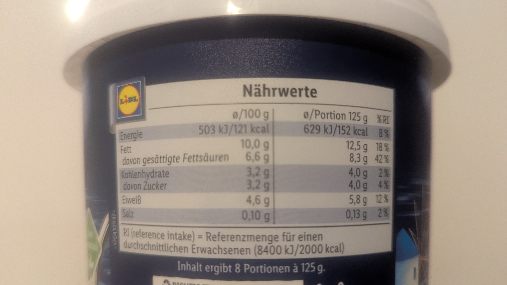

---
#### 2. 🔥 Calories

| Energy (Energie) | per 100g         | 
|------------------|------------------|
| Energy           | 121 kcal |

> ✅ Low-calorie option, good for cutting or maintaining weight.

---

#### 3. 🧈 Fat (Fett)

| Type                          | per 100g | 
|-------------------------------|----------|
| Total Fat (Fett)              | 10.0 g   |
| Saturated Fat (gesättigte Fette) | 6.6 g    | 

> ⚠️ Saturated fat is quite high — 42% of daily allowance per serving.

---

#### 4. 🍞 Carbohydrates (Kohlenhydrate)

| Type             | per 100g | 
|------------------|----------|
| Total Carbs      | 3.2 g    |
| of which Sugars  | 3.2 g    |

> ✅ Very low in sugar and carbs – suitable for low-carb diets.

---

#### 5. 🥚 Protein (Eiweiß)

| Protein | per 100g | 
|---------|----------|
|         | 4.6 g    |

> 🟨 Moderate protein level – useful as a light snack, but not a high-protein source.

---

#### 6. 🧂 Salt (Salz)

| Salt | per 100g |
|------|----------|
|      | 0.10 g   |

> ✅ Very low in salt.

---

#### 📋 Resume

- [x] Low in calories  
- [x] Low in sugar  
- [x] Low in salt  
- [ ] High in protein (moderate only)  
- [ ] Low in saturated fat 

---

### 🥣 Example 2: 🧀 GAZİ Grilled Cheese Nutrition Breakdown
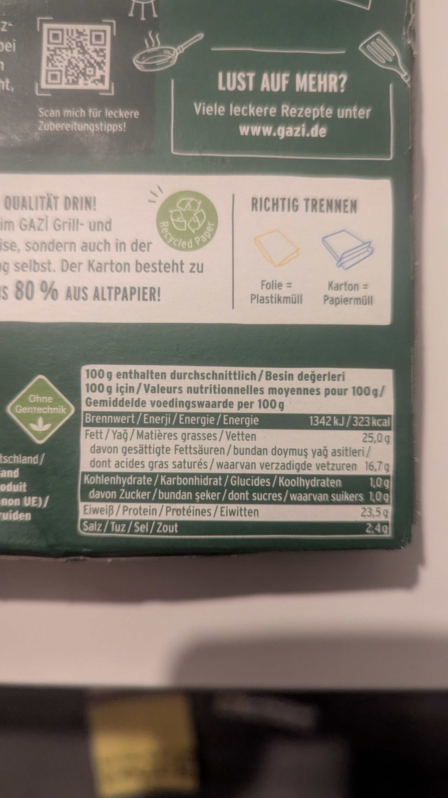

This grilled cheese product is **energy-dense**, high in **fat** and **protein**, and moderately salty. Here’s how to read the label:

---

#### 2. 🔥 Calories

| Energy (Energie) | per 100g          |
|------------------|---------------|
| Brennwert        | 323 kcal |

> 🧠 This is a **high-calorie product**.

---

#### 3. 🧈 Fat (Fett)

| Type                            | Value   |
|---------------------------------|---------|
| Total Fat (Fett)                | 25.0 g  |
| Saturated Fat (gesättigte FS)  | 16.7 g  |

> ⚠️ Very high in saturated fat.

---

#### 4. 🍞 Carbohydrates (Kohlenhydrate)

| Type           | Value |
|----------------|-------|
| Total Carbs    | 1.0 g |
| of which Sugar | 1.0 g |

> ✅ Very low in carbs and sugar.

---

#### 5. 🥚 Protein (Eiweiß)

| Protein | Value  |
|---------|--------|
|         | 23.5 g |

> 💪 High-protein cheese – great for muscle support and satiety.

---

#### 6. 🧂 Salt (Salz)

| Salt | Value |
|------|-------|
|      | 2.4 g |

> ⚠️ High in salt – over 40% of daily recommended intake per 100g.

---

#### 📋 Resume

- [x] High protein  
- [ ] Low fat  
- [ ] Low saturated fat (⚠️ very high!)  
- [x] Low sugar  
- [ ] Low salt (⚠️ quite salty)  
- [ ] Low calorie (⚠️ energy-dense)
---
# 🧾 Macro Tracking for Mortals  

This is how you **track your macros**, **weigh your food**, and **conquer your goals**.

Whether you're here to:
- 🏋️ Build muscle  
- 🧨 Burn fat  
- 🧘‍♀️ Not feel guilty eating  

---

## 🧠 The Macro Basics

**Macros = Macronutrients** =  
- **Protein** (4 kcal/g)  = 1 protein gram = 4 calories
- **Carbs** (4 kcal/g)  = 1 carb gram = 4 calories
- **Fat** (9 kcal/g)  = 1 fat gram = 9 calories

> ⚠️ TL;DR: **Fat is more than twice the calories of carbs or protein.** i.e. That peanut butter hits harder than you think.

---

## 🔍 🍲 Recipe 1: Veggies soup with chicken breast & fries

### 🛒 Ingredients:
- 🥦 **150g Cauliflower**  
- 🌱 **20g Edamame**  
- 🌿 **15g Peas**  
- 🍅 **15g Tomato**  
- 🧅 **15g Onion**  
- 🍗 **300g Chicken Breast**  
- 🍟 **30g Fries (cooked)**  
- 🧂 Salt, pepper, garlic, spicy stuff
---
- Carbs (Vegetables): 
	- Cauliflower: source of good carbs 👼
	- ⚠️ Edamame: high on protein (you get 12 protein grams per 100 Edamame grams)
	-  peas, tomato, onion: tasty
- Protein: 
	- Chicken breast: you get ~31 protein grams /100 grams and only 124 calories 💪
- Fat (Fries):
	-  ~160 calories/100 g in average; mostly Saturated Fat and evil carbs 😈
	-  just to make it tasty

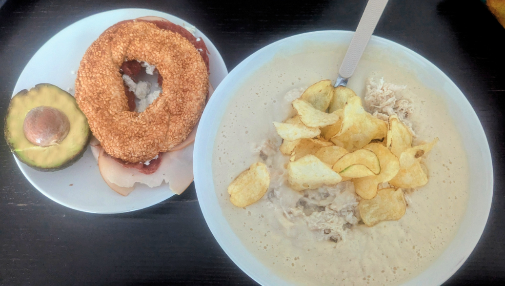

---

### 🔥 Instructions:

1. Toss all the veggies and chicken into a pressure cooker.
2. Add salt, pepper, garlic, and a touch of spice (or don’t 👸).
3. Cook for **30–40 mins** on pressure setting.
4. ⚠️CAREFULLY blend the veggies **using the cooking water**.
5. Shred the chicken and stir it into the blended soup.
6. Top with as many fries as your macro budget allows.
7. Enjoy. 

---

### ⚖️ Nutrition Facts (1 Serving – All Ingredients Combined)

| **Ingredient**         | **Amount (g)** | **Protein (g)** | **Carbs (g)** | **Fat (g)** | **Calories** |
|------------------------|----------------|------------------|----------------|--------------|----------------|
| Chicken breast         | 300            | 93.00            | 0.00           | 10.80        | 495.00         |
| Cauliflower            | 150            | 2.85             | 7.50           | 0.45         | 37.50          |
| Edamame                | 20             | 2.20             | 1.60           | 1.00         | 24.20          |
| Peas                   | 15             | 0.81             | 2.10           | 0.06         | 12.15          |
| Tomato                 | 15             | 0.14             | 0.58           | 0.03         | 2.70           |
| Onion                  | 15             | 0.17             | 1.40           | 0.02         | 6.00           |
| Fries (cooked)         | 30             | 0.78             | 10.50          | 4.50         | 93.60          |
| **TOTAL**              | **545g**       | **99.95 g**      | **23.68 g**    | **16.86 g**  | **671.15 kcal** |

> 💪 That’s **almost 100g of protein**, just 24g carbs, and 670 kcal for the whole thing.  
> Add fries freely if you're bulking. 
---

### 💪 Muscle Gain Version

| Ingredient        | Amount (g) |
|-------------------|------------|
| Chicken breast    | 400        |
| Cauliflower       | 200        |
| Edamame           | 30         |
| Peas              | 20         |
| Tomato            | 20         |
| Onion             | 20         |
| Fries             | 60         |
| **Total Weight**  | **750g**   |

> 🍗 Heavy on protein, moderate carbs, plenty of calories.  
> 🧠 Perfect post-workout meal. You'll feel like you could bench a bear.

---

### 🥦 Fat Loss Version

| Ingredient        | Amount (g) |
|-------------------|------------|
| Chicken breast    | 200        |
| Cauliflower       | 150        |
| Edamame           | 15         |
| Peas              | 10         |
| Tomato            | 15         |
| Onion             | 15         |
| Fries             | 10         |
| **Total Weight**  | **415g**   |

> 🥣 Lean, clean, and still full of gains.  
> 🧂 Minimal fries. Sorry, but shredded > salted.

---

### ⚖️ Notes:

- **Muscle Gain**: more chicken, more edamame, and extra fries for energy surplus and muscle repair.
- **Fat Loss**: reduced fat and fries, leaner chicken portion, still keeps protein high to preserve muscle mass.
- Adjust portion sizes to fit your personal daily calorie and macro goals.

---

## Bonus - 🥑 Half Hass Avocado + High-Protein Sandwich 

### 🥑 1. Half Hass Avocado

| Portion Size | Protein (g) | Carbs (g) | Fat (g) | Calories (kcal) |
|--------------|-------------|-----------|---------|-----------------|
| ~100g (1/2 large Hass) | 2.0         | 8.5       | 15.0    | ~160             |

> 🧠 Good fats 👼, fiber-rich, and makes your meals look bougie.

---

### 🥯 2. High-Protein Sandwich

- 1 sesame bagel (~100g)
- 2 slices of lean ham (~50g)
- 1 slice high-protein cheese (~25g)

| Ingredient         | Weight (g) | Protein (g) | Carbs (g) | Fat (g) | Calories |
|--------------------|------------|-------------|-----------|---------|----------|
| Sesame Bagel       | 100        | 9.0         | 48.0      | 3.0     | 265      |
| Ham (2 slices)     | 50         | 10.0        | 0.5       | 2.5     | 75       |
| High-Protein Cheese| 25         | 9.0         | 0.5       | 5.0     | 100      |
| **TOTAL**          | **175**    | **28.0**    | **49.0**  | **10.5**| **440**  |

> 💪 28g of protein in one sandwich? Not bad.  

---

## 🔄 Full Meal  (Estimated Total)

| Item                 | Protein (g) | Carbs (g) | Fat (g) | Calories |
|----------------------|-------------|-----------|---------|----------|
| Veggie Chicken Soup  | 100         | 24        | 17      | 670      |
| Sandwich             | 28          | 49        | 10.5    | 440      |
| Avocado (1/2)        | 2           | 8.5       | 15      | 160      |
| **TOTAL**            | **130g**    | **81.5g** | **42.5g** | **1270 kcal** |

> 📦 Macro-packed, solid for muscle gain or high-energy refuel.  

### 🧠 Final Thoughts:

- Perfect post-workout meal.  
- You can prepare this for 2 or 3 days, divide and freeze leftovers. microwave later only the portion you will eat (will easy if you divide it in advance) . Feel like a meal-prep god.  
- Fries = optional, but life’s too short to be that strict.

---
### 🥗 10 Minute Veggie Omelet  
**Calories:** 390 kcal  | **Protein:** 25g | **Carbs:** 35g | **Fat:** 15g  
**Calorie Level:** `Medium`  

**🧾 Ingredients:**  
- Coconut oil   
- 1/4 cup chopped tomatoes  
- 1 cup fresh spinach leaves  
- 1 cup chopped broccoli  
- 4 large egg whites, beaten  
- 2 tbsp (**tablespoon**) crumbled protein cheese  
- 1/4 tsp cayenne pepper  
- 2 slices Ezekiel Whole Grain bread, toasted  

**👨‍🍳 Instructions:**  
1. Heat a nonstick skillet on medium heat. Coat with coconut oil.  
2. Add tomatoes, spinach, broccoli, and cayenne pepper. Sauté for 4 minutes.  
3. Pour in beaten egg whites over veggies and sprinkle protein cheese on top.  
4. Cook 3–4 minutes, flip the omelet, and cook an additional 2 minutes.  
5. Serve hot with toasted bread.  

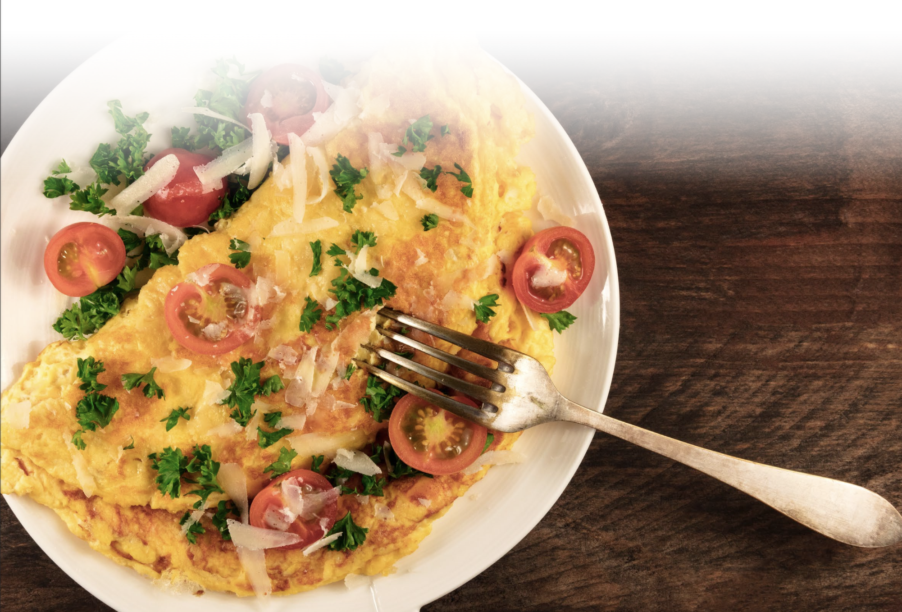

**🔁 Substitutions:**  
- **Bread** → *Any whole grain*  
- **Protein cheese** → *Feta or low-fat cottage cheese*  
- **Coconut oil** → *Olive oil or butter*  
---
### 🥗 Sweet & Sour Chicken  
**Calories:** 315 kcal  | **Protein:** 43g | **Carbs:** 21g | **Fat:** 7g  
**Calorie Level:** `Medium`  

**🧾 Ingredients:**  
- 1.25 lb chicken breast (cubed)  
- 3 egg whites  
- 1 tbsp coconut oil  
- 2/3 cup tomato sauce  
- 2 tbsp red chili garlic pepper sauce (sriracha)  
- 3 tbsp rice vinegar  
- 2 tbsp orange juice  
- 1 tbsp soy sauce  
- 1 tbsp minced garlic  
- 1/4 tsp cayenne pepper  
- Fresh scallions or green onions, chopped  
- Sesame seeds  

**👨‍🍳 Directions:**  
1. Cube the chicken and coat with cayenne and egg whites.  
2. Brown in a skillet with coconut oil, remove before fully cooked.  
3. Simmer the soil sauce and other ingredients in the same skillet.  
4. Return chicken to skillet and coat with sauce. Cook 6–8 min until done.  
5. Garnish with sesame seeds and scallions.  

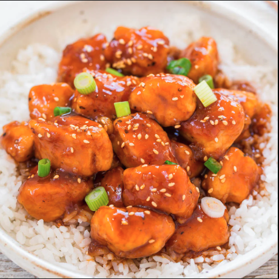

**🔁 Substitutions:**  
- **Coconut oil** → *Olive oil or avocado oil*  
- **Red chili garlic sauce** → *Chili paste*  
---
### 🥗 Tuna Salad  
**Calories:** 245 kcal  | **Protein:** 22g | **Carbs:** 10g | **Fat:** 15g  
**Calorie Level:** `Low`  

**🧾 Ingredients:**  
- 1 tuna can (~160 gr)
- 1/3 cup diced green onion  
- 1 chopped celery stalk  
- 2 tbsp pickle relish  
- 3 tbsp Greek yogurt  
- 2 tsp mustard  
- 1/2 tsp chili flakes  
- Juice from half a lemon  
- Salt & pepper to taste  
- Cilantro for garnish  

**👨‍🍳 Directions:**  
1. Drain tuna and mix all ingredients in a bowl.  
2. Mash with a fork and season to taste.  
3. Serve on salad or in a wrap.  

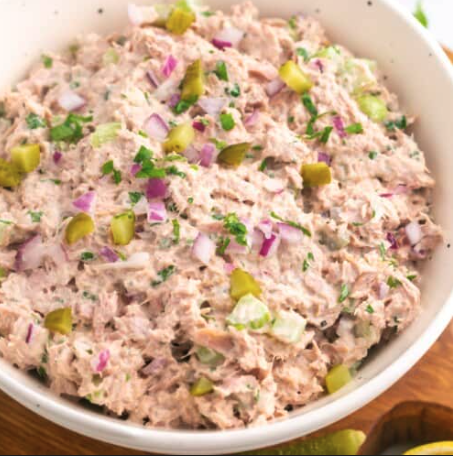

**🔁 Substitutions:**  
- **Greek yogurt** → *Low-fat mayo or cottage cheese*  
- **Mustard** → *Yellow mustard or spicy brown*  
- **Pickle relish** → *Chopped pickles*  
---
### 🥗 Southwestern Chicken Quesadillas  
**Calories:** 250 kcal  | **Protein:** 48g | **Carbs:** 27g | **Fat:** 13g  
**Calorie Level:** `Medium`  

**🧾 Ingredients:**  
- 1/4 cup hummus  
- 300gr raw chicken breast  
- 4 small whole wheat tortillas  
- 1 small avocado, sliced  
- 4 tbsp protein cheese  
- 1/2 cup black beans  
- 1/2 cup chopped red onion  
- 2 tbsp minced garlic  
- Cilantro and salsa for garnish  

**👨‍🍳 Directions:**  
1. Cook garlic and onions in a skillet.  
2. Add thinly cut chicken and cook through.  
3. Spread hummus on tortillas and layer chicken, beans, cheese, avocado, and cilantro.  
4. Fold tortillas and grill on skillet until crispy.  
5. Serve with salsa and Greek yogurt if desired.  

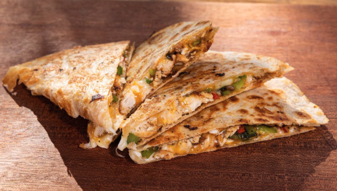

**🔁 Substitutions:**  
- **Protein cheese** → *Mozzarella or cheddar*  
- **Whole wheat tortillas** → *Low-carb wraps*  
- **Hummus** → *Mashed beans or Greek yogurt spread*  
---
### 🥗 Citrus Shrimp with Sautéed Veggies  
**Calories:** 250 kcal  | **Protein:** 42g | **Carbs:** 16g | **Fat:** 7g  
**Calorie Level:** `Medium`  

**🧾 Ingredients:**  
- 1 lb shrimp, peeled  
- 3 zucchinis, chopped  
- 15 grams Spinach, chopped  
- 1 onion, chopped  
- 4 carrots, chopped  
- 1 tbsp coconut oil  
- 2 tbsp lemon juice  
- 1 tbsp apple cider vinegar  
- Juice from 1/2 orange  
- Salt-free seasoning and lemon pepper  

**👨‍🍳 Directions:**  
1. Sauté onion and garlic in coconut oil.  
2. Add veggies and cook until soft.  
3. Add shrimp and spices, cook until pink.  
4. Add lemon-orange sauce and cook 1 more minute.  
5. Serve with fresh lemon wedges.  

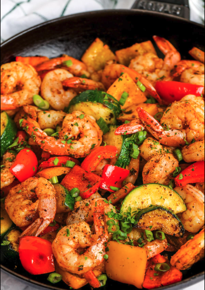

**🔁 Substitutions:**  
- **Shrimp** → *Chicken or tofu*  
- **Coconut oil** → *Avocado oil or olive oil*  
- **Zucchini** → *Yellow squash or eggplant*  
---
### 🥗 Pesto Pita Pizza  
**Calories:** 269 kcal  | **Protein:** 27g | **Carbs:** 12g | **Fat:** 12g  
**Calorie Level:** `Medium`  

**🧾 Ingredients:**  
- 160 gr cooked chicken  
- 1 whole wheat pita  
- 1/4 cup diced cucumber  
- 1/4 cup diced tomatoes  
- 1/8 cup black olives  
- 1/8 cup parmesan cheese  
- Basil pesto  

**👨‍🍳 Directions:**  
1. Toast pita lightly.  
2. Top with pesto, then chicken and veggies.  
3. Sprinkle olives and parmesan on top.  
4. Bake for 4 minutes until cheese melts.  

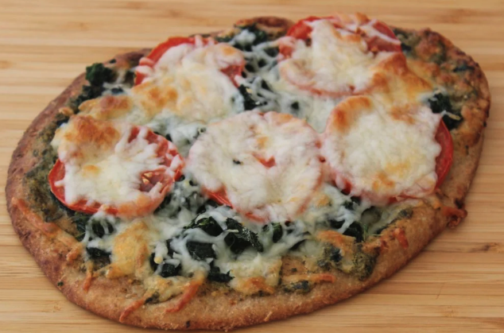

**🔁 Substitutions:**  
- **Pita** → *Flatbread or arabic bread*  
- **Parmesan** → *Feta or mozzarella*  
- **Basil pesto** → *Dried tomato spread*  
---
### 🥗 Spicy Orange Chicken  
**Calories:** 259 kcal  | **Protein:** 42g | **Carbs:** 17g | **Fat:** 2g  
**Calorie Level:** `Medium`  

**🧾 Ingredients:**  
- 1 lbs chicken breast  
- 1/4 cup soy sauce  
- 1/3 cup rice wine vinegar  
- 3 tbsp red pepper garlic sauce  
- 1/4 cup raw honey  
- 2 tbsp sugar-free orange marmalade  
- Juice from 3 oranges  
- 1 tbsp tapioca starch  
- Sesame seeds  
- Green onions  

**👨‍🍳 Directions:**  
1. Mix soy sauce, vinegar, juice, marmalade, honey, and starch for sauce.  
2. Chop chicken and cook 90% through in skillet.  
3. Add sauce to pan and cook until thickened.  
4. Top with sesame seeds and green onions.  

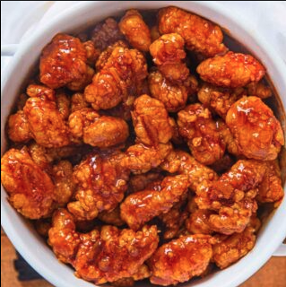

**🔁 Substitutions:**  
- **Orange marmalade** → *Orange with honey*  
- **Tapioca starch** → *Bread powder*  
---
### 🥗 Spinach Chicken  
**Calories:** 450 kcal  | **Protein:** 30g | **Carbs:** 35g | **Fat:** 18g  
**Calorie Level:** `High`  

**🧾 Ingredients:**  
- 1 lb ground chicken  
- 1 onion, diced  
- 2 cloves garlic, minced  
- 1 egg white  
- 1 tbsp coconut/olive/avocado oil  
- 2 tbsp tomato paste  
- 1/2 cup tomato sauce  
- 1 cup fresh spinach  
- 2 tbsp cilantro  
- 2 tbsp chopped basil  

**👨‍🍳 Directions:**  
1. Sauté onion and garlic.  
2. Mix ground chicken with egg white, herbs, spinach, onion and garlic.  
3. Form into balls and place in baking dish.  
4. Top with sauce and bake 20 min at 200°C.  

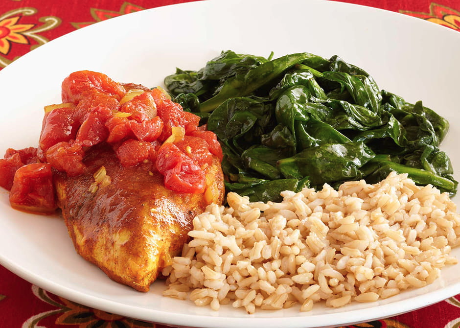

**🔁 Substitutions:**  
- **Ground chicken** → *Ground turkey or tofu*  
- **Tomato paste** → *Crushed tomato or ketchup (less ideal)*   
---
### 🥗 Avocado-Ranch Salad  
**Calories:** 207 kcal  | **Protein:** 7g | **Carbs:** 27g | **Fat:** 9g  
**Calorie Level:** `Low`  

**🧾 Ingredients:**  
- 1 avocado  
- 1/2 cup Greek yogurt  
- 1 tbsp white vinegar  
- 1/2 tsp garlic powder  
- 1/4 tsp salt & pepper  
- 8 cups baby spinach  
- 1 red bell pepper  
- 1 can chickpeas  

**👨‍🍳 Directions:**  
1. Blend half avocado with yogurt, dill, vinegar, and seasoning.  
2. Chop remaining avocado and toss with spinach, pepper, chickpeas.  
3. Coat with dressing and serve.  

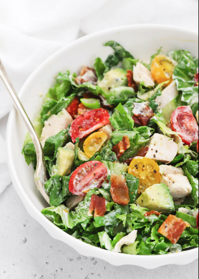

**🔁 Substitutions:**  
- **Greek yogurt** → *Low-fat sour cream*  
- **Chickpeas** → *White beans or black beans*  
---
### 🥗 Balsamic Chicken and Veggies  
**Calories:** 269 kcal  | **Protein:** 27g | **Carbs:** 12g | **Fat:** 12g  
**Calorie Level:** `Medium`  

**🧾 Ingredients:**  
- 3 tbsp olive/coconut/avocado oil  
- 5 tbsp balsamic vinegar  
- 1 tbsp honey  
- 1/4 tsp red pepper  
- 1 lb chicken breast  
- 200 gr asparagus  
- 1 cup shredded carrots  
- 1 head kale  
- 2 tomatoes  

**👨‍🍳 Directions:**  
1. Make dressing from vinegar, oil, honey, red pepper.  
2. Cook chicken in skillet 6 min each side.  
3. Sauté veggies and add remaining dressing.  
4. Serve chicken over veggies and top with tomatoes.  

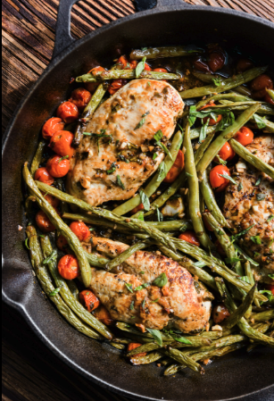

**🔁 Substitutions:**  
- **Kale** → *Spinach*  
- **Balsamic vinegar** → *Apple cider vinegar*  
- **Honey** → *Maple syrup*  
# Supplements

## 🧠 Creatine & Protein Shakes

## 💥 CREATINE MONOHYDRATE

### ❓ Why Use Creatine?
- Increases **ATP production**, your muscles’ primary energy source during high-intensity exercise.
- Boosts **strength**, **power**, and **muscle volume**.
- Helps with **recovery**, **hydration**, and **brain performance** (Ref.)[https://pmc.ncbi.nlm.nih.gov/articles/PMC6093191/].

### 🕒 When to Take Creatine
- 📅 **Daily** — consistency matters more than timing.
- 🏋️ **Best time**: After workout (post-workout) for enhanced uptake.
- Can also be taken pre-workout or with meals if preferred.

### 💧 How to Take Creatine
- ✅ **Type**: Creatine monohydrate is the most researched and effective.
- ⚖️ **Dosage:** 5g per day.
- 💦 Mix with water or any drink containing carbs for better absorption.
- 🚰 **Hydration is key!** Drink extra water daily to support creatine uptake.

### 🔁 Tips & Notes
- 🧪 Backed by 1,000+ studies — safe for long-term use in healthy individuals.
- ❌ No need to cycle off.
- ⚠️ Bloating? Reduce to 3g/day or spread out the dose.

---

## 🥤 PROTEIN SHAKES

### ❓ Why Use Protein Shakes?
- Helps you reach your **daily protein goal** (especially if you train hard).
- Supports **muscle growth**, **repair**, and **satiety**.
- Convenient — ideal for **post-workout** or busy schedules.

### 🕒 When to Take Protein
- ⏱️ **Post-workout**: Within 30–60 minutes for optimal recovery (muscle protein synthesis).
- 💤 **Before bed**: Casein protein can support overnight recovery.
- 🍳 **When meals lack protein**: Use as a supplement, not a replacement.

### 🍶 How to Take Protein
- ✅ **Types**:
  - **Whey isolate**: Fast-digesting, high bioavailability.
  - **Whey concentrate**: More budget-friendly, slightly slower absorption.
  - **Casein**: Slow digesting — ideal before bed.
  - **Plant-based** (pea, rice, hemp): Great for dairy-free/vegan diets.
- ⚖️ **Dosage**:
  - 20–30g per serving is ideal for most people.
  - Adjust based on total daily protein target (~1.6–2.2g per kg body weight).

### 🥄 How to Mix It
- Mix with:
  - Water (faster digestion)
  - Milk or plant milk (adds calories, creaminess)
  - In smoothies (with banana, peanut butter, oats, etc.)

### 🔁 Tips & Notes
- Look for a brand with:
  - **>20g protein per scoop**
  - **<3g sugar**
  - No unnecessary fillers or proprietary blends.
- Digestive issues? Try hydrolyzed whey or plant blends.

---

## ⚔️ Creatine vs. Protein — Quick Comparison

| Feature         | Creatine                      | Protein Shake                 |
|----------------|-------------------------------|-------------------------------|
| Goal           | Strength, Power, Muscle Volume| Muscle Repair & Growth        |
| Timing         | Daily, ideally post-workout   | Post-workout, anytime needed  |
| Main Benefit   | Cellular energy + water retention | Amino acids for tissue repair|
| Dose           | 5g/day                       | 20–30g/serving                |
| Cycle Needed?  | ❌ No                          | ❌ No                          |
| Stack Together?| ✅ Yes                         | ✅ Yes                         |

---

> 📌 **Pro Tip:** Use both together **post-workout** for a powerful recovery stack:  
> - 5g creatine  
> - ~25g protein  
> - Mixed with water or milk and a carb source (like banana or oats).
---
# 🧠 Supplement Guide: Creatine & Protein Shakes

## 💊 DAILY SUPPLEMENT ROUTINE

### 🕖 Morning (upon waking)
- ✅ **Multivitamin** (optional but useful)  
  Supports micronutrient coverage.
- ✅ **Omega-3 (Fish Oil)** — *1–2g EPA/DHA*  
  Reduces inflammation, supports heart and joint health.
- ✅ **Creatine Monohydrate** — *5g*  
  (If not taken later post-workout. Consistency is key.)
- ✅ **Vitamin D3** — *2,000–4,000 IU*  
  Especially if you're not getting sunlight.

---

### 🏋️ Pre-Workout (30–60 min before training)
- ✅ **Caffeine** — *100–200mg*  
  Improves focus and performance (if tolerated).
- ✅ **Creatine** — *5g* (if not taken earlier)
- ✅ **BCAA/EAA** — *5–10g* (optional)  
  Useful if training fasted or on low protein intake.

---

### 🧃 Post-Workout (within 30–60 min)
- ✅ **Protein Shake** — *20–30g whey isolate or plant protein*  
  Supports muscle recovery and growth.
- ✅ **Creatine Monohydrate** — *5g* (if not taken earlier)
- ✅ **Fast carbs** — *banana, oats, or dextrose* (optional)  
  Helps replenish glycogen and support creatine uptake.

> ✅ **STACK TIP:**  
> Mix **protein + creatine + banana + oats** in a shaker or blender for a full recovery drink.

---

### 🌙 Before Bed
- ✅ **Casein Protein or Greek Yogurt** — *20–30g protein*  
  Supports overnight muscle repair.
- ✅ **Magnesium Glycinate** — *200–400mg* (optional)  
  Helps sleep quality and muscle relaxation.
- ✅ **Zinc** — *10–30mg*  
  Supports testosterone, recovery, and immunity.

---

## 💬 Notes:
- 💧 **Hydration is critical** for creatine to work effectively. Aim for 3+ liters of water per day.
- 📅 You don’t need to **cycle creatine** — daily use is safe and more effective.
- 🕒 Timing matters **less than consistency**, especially with creatine and vitamin D.
